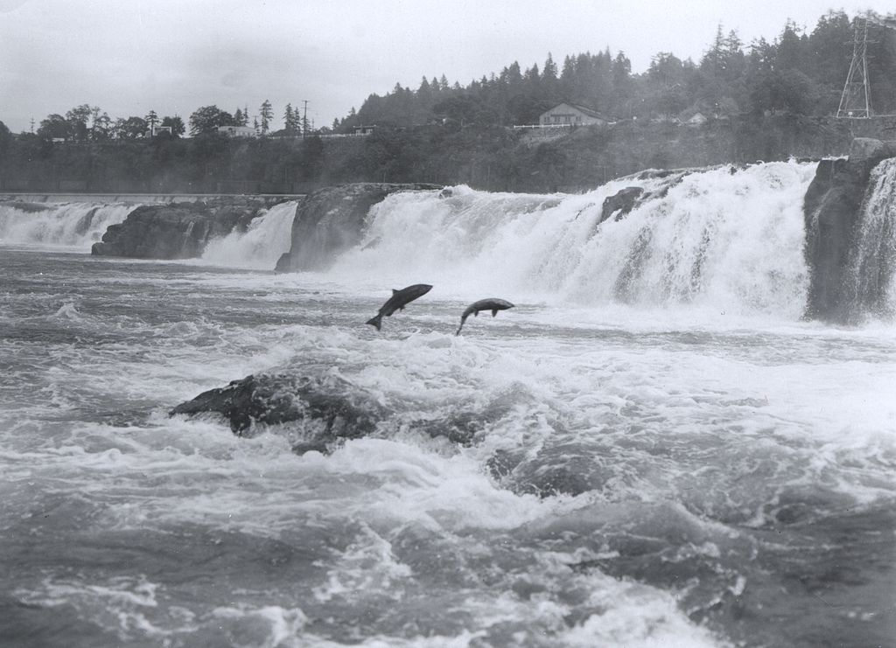

```{r setup, include = FALSE, echo = TRUE, message = FALSE, warning = FALSE}
knitr::opts_chunk$set(echo = TRUE, message = FALSE, warning = FALSE)

library(tidyverse)
library(here)
library(lubridate)
library(tsibble)
library(feasts)
library(slider)

```


## Overview {.tabset}

Using daily time series data from the Columbia River Data Access in  Real Time (DART) collected by the Oregon Department of Fish and Wildlife, this analysis identifies trends in fish ladder passage counts in Willamette Falls for three species of salmon: coho (*Oncorhynchus kisutch*), jack coho, and steelhead (*Oncorhynchus mykiss*). Because migration upstream is such an integral part to the life histories of salmon, fish ladders were constructed to facilitate salmon passage over obstacles such as dams. Monitoring of salmon populations takes the form of fish counts at fish ladders through various different methods, including counts through the ladder main viewing window and daily video recordings. 

**Data citation:** Columbia Basin Research, University of Washington. 2023. DART Adult Passage Graphics & Text. http://www.cbr.washington.edu/dart/query/adult_graph_text




### Original Time Series 

```{r}
# read in the data 

fish_passage <- read_csv(here("data", "willamette_fish_passage.csv")) %>% 
  janitor::clean_names() %>% 
  replace(is.na(.), 0)

# create subset for species of interest: coho, jack coho, and steelhead salmon :)
fish_passage_sub <- fish_passage %>% 
  select(date, steelhead, coho, jack_coho)

# convert data frame into a tsibble

fish_sub_ts <- fish_passage_sub %>% 
  mutate(date = lubridate::mdy(date)) %>% 
  as_tsibble(key = NULL, index = date)

# Pivot table so that species are in the same column

fish_ts_long <- fish_sub_ts %>% 
  pivot_longer(cols = 2:4,
               names_to = "species",
               values_to = "count")

# facilitate facet wrap plotting

fish_spp <- c("Coho", "Jack Coho", "Steelhead")

names(fish_spp) <- c("coho","jack_coho","steelhead")
```


```{r}
# Plotting time series for 3 species 

ggplot(data = fish_ts_long, 
       aes(x = date, 
           y = count,
           color = species)) +
  geom_line() +
  facet_wrap(~species,
             nrow = 3,
             labeller = labeller(species = fish_spp)) +
  labs(x = "Date",
       y = "Daily Fish Count",
       color = "Species") +
  scale_color_manual(values = c("darkslategray3", "darkslategray4", "darkslategrey")) +
  theme_bw()
```

**Figure 1.** Time series of adult coho, jack coho, and steelhead salmon passage through the fish ladder at Willamette Falls, OR between 2001 and 2010.

Notable trends in the time series data:

- Coho salmon passage has increased over time compared to jack coho and steelhead salmon.
- There appears to be trends in seasonality when it comes to fish passage count, as counts are greater towards the middle of the year. This is most likely as a result of the migratory nature of salmon.


### Seasonplots 


```{r}
fish_ts_long %>% 
  gg_season(y = count,
            pal = c("lightslategrey","darkslategray3", "darkslategray4", "darkslategrey")) +
  facet_wrap(~species, 
             nrow = 3, 
             labeller = labeller(species = fish_spp)) +
  labs(x = "Month",
       y = "Daily Fish Count",
       color = "Year") +
  scale_x_date(date_breaks = "1 month",
               date_labels = "%b") +
  theme_bw()
```

**Figure 2.** Seasonplots for adult coho, jack coho, and steelhead salmon passage through the fish ladder at Willamette Falls, OR. Each line (ranging in shades of blue) represents each year from 2001 to 2010.

- While both coho and jack coho salmon passage occurs in the late-summer to mid-fall season, steelhead salmon passage has a greater seasonal window (passing through most of the year).
- There is little overlap between steelehad and coho salmon passage times, demonstrating the unique life histories of each species of salmon. 

### Annual Counts By Species

```{r}
# new dataframe for counts by species

count_year <- as.data.frame(fish_ts_long) %>% 
  mutate(year = lubridate::year(date)) %>% 
  select(-date) %>% 
  group_by(year, species) %>% 
  summarize(year_n = sum(count))
```

```{r}
## data visualization

ggplot(data = count_year, aes(x = year, y = year_n)) +
  geom_col(aes(fill = species), 
           color = "royalblue4") +
  scale_fill_manual(values = c("darkslategray3", "darkslategray4", "darkslategrey"),
                     labels = c("Coho", "Jack Coho", "Steelhead")) +
  scale_x_continuous(breaks = seq(from = 2001, to = 2010, by = 1)) +
  labs(x = "Year",
       y = "Annual Counts") +
  theme_bw()
 
```


**Figure 3.** Annual counts of coho, jack coho, and steelhead salmon passage through the fish ladder at Willamette Falls, OR from 2001 to 2010.

Notable trends:

- Steelhead salmon have had the highest passage counts during 2001 to 2010 with the exception of 2009, when coho salmon were most abundant.
- Salmon counts dropped drastically after 2004, reaching its previous counts in 2009. 

