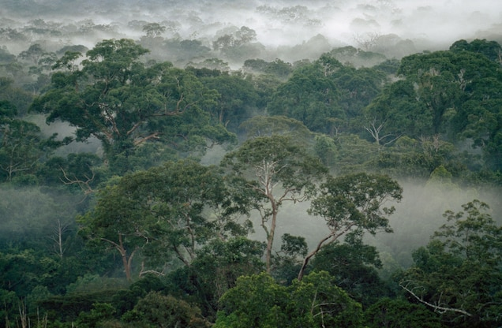

```{r setup, include=FALSE, echo = TRUE, warning = FALSE, message = FALSE}
knitr::opts_chunk$set(echo = TRUE, warning = FALSE, message = FALSE)
library(tidyverse)
library(readtext)
library(here)
library(tidytext)
library(textdata)
library(pdftools)
library(ggwordcloud)
```

## Overview:

In this analysis, an article regarding climate change and forest growth is analyzed to determine which words are used most frequently. These words will be visualized in a word cloud. A sentiment analysis will then take place on those most frequently used words to investigate the tone of this article. This article, "Will Climate Change Upend Projections of Future Forest Growth?", was written by Gabriel Popkin and was published by the Yale School of the Environment's online magazine *Yale Environment 360*.

**Data citation:** Popkin, G. (2020, July 7). Will climate change upend projections of future forest growth? Yale Environment 360. Retrieved March 20, 2023, from https://e360.yale.edu/features/will-climate-change-upend-projections-of-future-forest-growth#:~:text=While%20the%20world's%20forests%20can,that%20reduce%20their%20ability%20grow. 




First we will tidy up the data. 

```{r, cache = TRUE}
## Get Article

clim_forest <- readtext(here("data","climate_forest_growth.txt"))
```


```{r}
# turn into data frame

clim_forest_words<- data.frame(clim_forest) %>% 
 unnest_tokens(word, text, token = "words") %>% 
  select(word)

# remove stop words

cf_words_clean <- clim_forest_words %>% 
  anti_join(stop_words, by = "word")
```

## Identifying and Visualizing Most Frequently Used Word Counts

```{r}
# count total number of non stop-words

cf_count <- cf_words_clean %>% 
  count(word)

# extract top 50 words used

cf_top50 <- cf_count %>% 
  slice_max(order_by = n, n = 50)
```

```{r, fig.cap = "**Figure 1.** The 50 most frequently used words in the article, 'Will Climate Change Upend Projections of Future Forest Growth?'. Words in green and in the bigger size are the most commonly used."}
ggplot(data = cf_top50, 
                   aes(label = word,
                       size = n,
                       color = n)) +
  geom_text_wordcloud(shape = "diamond") +
  scale_size_area(max_size = 9.5) +
  scale_color_gradient(low = "black", high = "chartreuse4") +
  theme_minimal()
```

Given the subject of this article, it makes sense that the most commonly used words are "carbon", "forests", and "climate". The words that are not as common but are still within the top 50 words used can provide guidance for those addressing the issues of forest growth in the face of climate change - "models", "data", "vapor", "deficit".


## Sentiment analysis
```{r}

nrc_lex <- get_sentiments(lexicon = "nrc")

cf_nrc <- cf_words_clean %>% 
  inner_join(nrc_lex, by = "word")


### count how many words for each sentiment
cf_nrc_counts <- cf_nrc %>% 
  count(sentiment) %>% 
  mutate(pct_total = (n/sum(n))*100) %>% 
  mutate(sentiment = factor(sentiment, 
                            levels = c('anger', 'anticipation', 
                                       'disgust', 'fear', 'joy', 
                                       'negative', 'positive', 
                                       'sadness', 'surprise', 'trust')))
```

```{r, fig.cap = "**Figure 2.** Sentiment analysis using NRC lexicon for the article 'Will Climate Change Upend Projections of Future Forest Growth?', written by Gabriel Popkin (2020)."}
### visualize
ggplot(data = cf_nrc_counts, aes(x = pct_total, y = sentiment)) +
  geom_col(color = 'darkolivegreen',
           fill = "darkolivegreen4") +
  labs(y = "Sentiment",
       x = "Proportion of words used (%)") +
  theme_minimal()
```

This figure demonstrates the range of sentiments used in this article. It is interesting that the highest proportion of words used (~24%) fall into the positive sentiment category given the nature of the article - while forests are often seen as the solution to our climate crisis, this article raises the question of how climate change will impact the efficiency of that solution. This leads to the assumption that most words would fall under the negative category, but shows the approach of the article of including positive sentiments to incite hope despite the doom and gloom of climate change.

**Sources**

- Crowdsourcing a Word-Emotion Association Lexicon, Saif Mohammad and Peter Turney, *Computational Intelligence*, 29 (3), 436-465, 2013.
